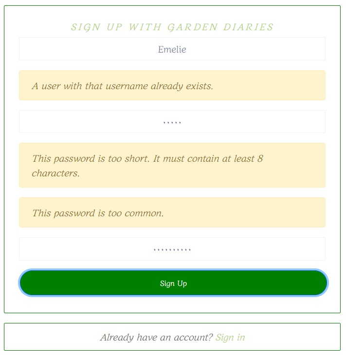
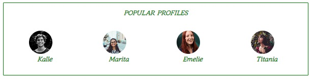
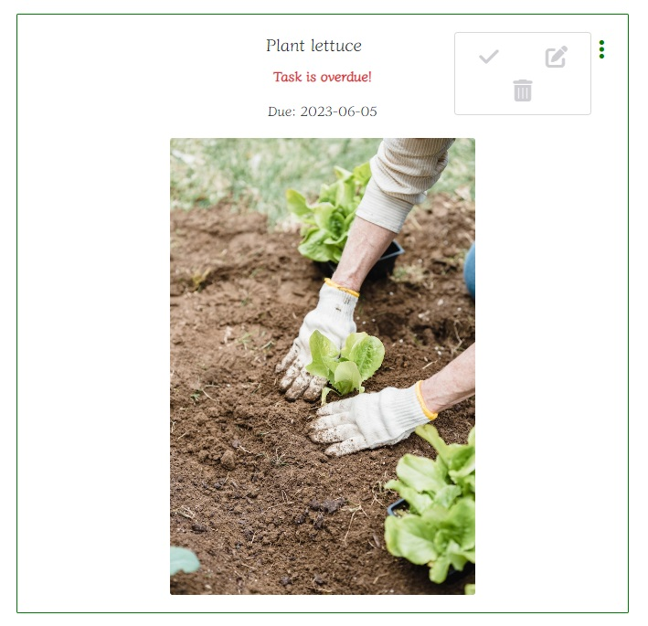

# Garden Diaries

## Milestone project 5 

Garden Diaries is an social networking platform designed specifically for avid hobby gardeners. With its user-friendly interface and comprehensive features, Garden Diaries offers a unique space for users to document and share their garden journeys through diary entries.

In addition to sharing their experiences, users can actively engage with the community by liking and commenting on posts. Garden Diaries provides a user-friendly "follow" feature, enabling users to effortlessly stay connected with their favorite content creators.

To keep their garden organized, Garden Diaries lets users to maintain an organized record of their plants. By uploading lists detailing information such as planting instructions, plant types, planting dates, and accompanying images, users can effortlessly track and monitor their garden.

Garden Diaries also offers convenient to-do and shopping lists. These practical tools lets users stay on top of their gardening tasks and effortlessly manage their shopping needs.

In summary, Garden Diaries is a platform that seamlessly integrates social networking and garden management.

Garden diaries is a fictional website created as a milestone project for Code Institutes fullstack developer course. 

## Live website
View live website here: [Garden Diaries](https://garden-diary.herokuapp.com/)

## Table of contents

- [Garden diaries](#garden-diaries)
- [Live website](#live-website)
- [Project](#project)
    - [Objective](#objective)
    - [Site user goal](#site-user-goal)
    - [Site owner goal](#site-owner-goal)
- [Project management](#project-management)
    - [Github project board, user stories, issues and milestones](#github-project-board-user-stories-issues-and-milestones)
    - [Wireframes](#wireframes)
- [Typography and color scheme](#typography-and-color-scheme)
    - [Typography](#typography)
    - [Color scheme](#color-scheme)
    - [Imagery](#imagery)
- [Features](#features)
    - [Existing features](#existing-features)
    - [Future features](#future-features)
- [Technology](#technology)
    - [Languages](#languages)
    - [Frameworks](#frameworks)
    - [Other software and libraries](#other-software-and-libraries)
- [Testing](#testing)
    - [Automated tests](#automated-tests)
    - [Manual testing](#manual-testing)
        - [Browser test](#browser-test)
        - [Lighthouse](#lighthouse)
- [Deployment](#deployment)
    - [Github & Gitpod](#github--gitpod)
    - [Create a React project and app](#create-a-react-project-and-app)
    - [Heroku](#heroku)
- [Credits](#credits)

# Project

## Objective
The objective of this project and website was to create a fifth portfolio submission for Code Institutes fullstack developer program. Among following the projects assessment criteria, the website needed to be built using React, JSX (HTML, JavaScript and CSS) and appropriate frameworks and libraries, and connected to a separate [backend API](https://garden-diary-api.herokuapp.com/). The application needed to have complete CRUD (create, read, update and delete) functionality on the Front-End for users to work with data from an API.

I've chosen to create a project aimed toward my own interests to find inspiration, and choose to create a social networking website targeted towards hobby gardeners. 

**The project is party based on the Code Institute Moments course material**, using some of the code provided there, with additional functionality and styling added by me. 

## Site user goal
Users of Garden Diaries could have several goals, such as wanting to share and take part of diary posts, networking through the comments and follow content pandering to their interests. Users can also use Garden Diaries to keep organized, keeping lists of their plants, tasks and shoppinglist for their garden.

## Site owner goal
As a site owner the goal is to provide a stable and enjoyable user experience, that encourages user interaction. The website should be accessible, appealing and contain content that is well structured, intuitive and of high standard. Site administrator should make sure the content is monitored to meet community standard.

# Project management

## Github project board, user stories, issues and milestones
Garden Diaries was developed using an agile methodology, using Github issues, milestones and projectboard to track tasks during the project.

GitHub project board and issues played a significant role in this process, allowing for the creation of user stories and their organization in the to-do, in progress and done sections. As work began, these tasks were moved from the to-do section, to the in-progress section and later to the done section when completed, providing an efficient way to track progress and manage tasks.

Garden diaries consists of a number of user stories, labled to keep them easily organized. User stories were sorted into iterations, Milestones, that were used to structure and allocate the work as the project went on. Issues that wont be finished for this projects deadline is added to the [Garden diaries backlog](https://github.com/EmelieMarkkanen/p5-garden-diary/milestone/5).

- [User stories](https://github.com/EmelieMarkkanen/p5-garden-diary/issues?q=is%3Aopen+is%3Aissue)
- [Milestones](https://github.com/EmelieMarkkanen/p5-garden-diary/milestones)
- [Project board](https://github.com/users/EmelieMarkkanen/projects/5/views/1)

## Wireframes
Wireframes created using [Balsamiq](https://balsamiq.com/) to plan the general flow and display of Garden Diaries. Some differences may be found between the original wireframes and the finished site due to design choices made during the project process.

- [Home page](src/assets/PDF/home-page.pdf)
- [Profile](src/assets/PDF/Bio.pdf)
- [Tasks/Plants](src/assets/PDF/Task-Plant.pdf)
- [Forms](src/assets/PDF/form.pdf)
- [Shoppinglist](src/assets/PDF/list.pdf)

# Typography and color scheme

## Typography
Font used throughout the website is Diphylleia, imported from [Google fonts](https://fonts.google.com/specimen/Diphylleia).

## Color scheme
Color scheme is made up of white and different green shades to match the project theme. 

## Imagery
Images are imported from [Pexels](https://www.pexels.com/). No result image is imported from [Sooraj MV on Dribbble](https://dribbble.com/shots/3399669-No-Results-Found). Logo is imported from [PNGEgg](https://www.pngegg.com/en/png-zfjmh). Favicon is generated from logo image through [Favicon generator](https://www.favicon-generator.org/). 

# Features

## Existing features

### Navbar
Garden Diaries feature a navbar that is present on all pages of the site. The navbar links change depending on wether the user is signed in or not, giving the user access to different features of the site. If the user is not signed in, the navbar show links to the sign in or sign up pages. If a user is signed in the navbar shows the users profile avatar image and their username (linking to the users profile), Followed, Liked entries, My Plants, To-do list, Shoppinglist and sign out, as well as the Add a diary entry. The navbar also feature the Garden Diaries logo. 

### Sign up
To sign up to Garden Diaries the user will need to fill out a form with preferred username and password. After submitting the form with valid data they are redirected to the sign in page. The page features a link to the sign in page, if the user is already signed up with Garden Diaries. 

If the user tries to submit an invalid form (already existing username, password to short or similar to username, missed to fill out a field) they are notified through a message and asked to correct their submission. 

### Sign in

After signing up with Garden Diaries a user can sign in by filling out the sign in form. When submitting a valid form they are redirected to the home page. 

If the user tries to submit an invalid form (wrong username or password, blank field) they are notified through a message and asked to correct their submission. 

### Jumbotron
Non signed in visitors is greeted by a welcome message describing Garden Diaries and a link to the sign up form. The message is hidden once the user sign in. 

### Diary post feed
Users diary posts are displayed in the post feed on the home page, sorted by latest posts by all users. The feed features infinite scrolling, as long as there is content the user can scroll further. 

Clicking on the comments icon will redirect the user to a detailed view of the post and it's commentfield. 

### Add a diary entry
Users can add a new diary post through a form, with title, notes and an image. The post is displayed in the post feed and in the users profile post feed.
The cancel button redirects the user back to the previous page and no post is made.

### Popular profiles
The popular profile section features the users with the most followers, to let other users easily find new interesting content. This section is responsive, displaying differently on large and smaller screens. Clicking the `Follow` button saved the posts by that user in the `Followed` section.

### Follow - Followed
By clicking the `Follow` button, either in the Popular profiles section or in a users profile bio will let users follow each others content, having the followed users posts display on the Followed page. Clicking `Unfollow` will let users stop following a user and remove their posts from the Following feed.

The amounts of followers and following for a user can be seen in their profile bio. 

### Searchbar
The diary entry feed, My plants, To-do list, Shoppinglist, Following and Liked entries feature a searchbar for easy navigation. If no match to searchquery can be found a No results image and message is displayed. 

### Profile page
Clicking the avatar image or username in the navbar redirects the user to their own profile page. Here they can view all their own diary posts, add a bio and profile image, see how many posts they've made, how many other users they are following and how many are following them. Clicking the dropdown menu lets the user edit their username, password and bio. 

If a user tries to edit their username to an already existing one they will be notified of this. If they try to change their password to an invalid one they will be notified of this. 

### Like - Liked entries
By clicking the heart icon on a diary post a user can like the post, increasing the likes count on a post. The post is also saved to the Liked entries feed, so that users can find and read their favorite entries again. 
By clicking the heart icon again the likes count is decreased and the post is  removed from the Liked entries feed. 

User can not like their own post, and are notified if they try to click the heart icon on their own post. 

### Comments
Users can comment on posts through the commentfield. When posting a comment the comments count on the post is increased, and decreased if a user deletes their comment.

Only the user who posted the comment can edit or delete it.

### My plants
User can keep a list of their own plants, with instructions, image, date for when it was planted and what kind of plant it is. 
Plants are displayed as cards, clicking on the card will redirect the user to a detailed view of the plant post, where the user can choose to edit or delete the plant post. If the user clicks on the delete icon, they are notified with a popup, asking if they really want to delete the plant post.

When choosing to edit a plant post the user is redirected to a prepopulated form. 

### To-do list
User can keep a list of tasks to do in their garden, sorted by due dates closest to todays date, with overdue tasks displayed at the top. Tasks are displayed as cards, with information about when the task was added, the due date and a checkmark to set tasks as done. The user can choose to upload an image, otherwise a default image is added. 
Clicking the card redirects the user to a detailed view of the task, where the user can choose to edit, delete or set the task as done. When a task is set as done it is deleted from the task list. If the user clicks on the delete icon, they are notified with a popup, asking if they really want to delete the task. 

When choosing to edit a task the user is redirected to a prepopulated form. 

If a tasks due date is passed, the task is automatically set as overdue, and a red exclamation icon is displayed on the task card, and the message `Task is overdue!` is displayed in the detailed task view. 

### Shoppinglist
Users can keep a list of things they need to purchase for their garden. The list is sorted by last item added. Users add new items by filling out the item name and quantity in the form, the list is automatically updated. Users can edit or delete items by clicking the dropdown menu. 

### Page not found
If the user tries a url that dont exist on Garden Diaries, they are redirected to a `Page not found`, which let them redirect back to the home page. 

## Future features
These are a few examples of features that would increase the user experience for Garden Diaries that I would like to implement in the future.

### Profile image upload on sign up
User can add a profile image when signing up to Garden Diaries, instead of adding one after signing in the first time. 

### Thumbnail images for shopping list
User can upload an image that will be displayed as a thumbnail images next to the item name.

### Sorting shoppinglist items by different criteria
User can sort items in the list by name, quantity, created at date and the like. 

### Post owner can delete comments on their posts
User can delete unwanted comments by other users on their diary entries. 

### Private diary entries
User can post private diary entries not shared with other users and saved in a separate feed.

### Image caching
Website performance on large screens could be enhanced by caching images, using for example a library like **Workbox**.

## Responsive
Garden diaries is fully responsive for all screen sizes. 

# Components and hooks

## Components
Garden Diaries contain of eight unique components that can be used throughout the project.
- Asset: render a loading spinner, an image, and/or a message, set by the props. 
- Avatar: displays the users profile image.
- Jumbotron: displays Garden Diaries welcome message.
- MoreDropDown: displays a dropdown menu for edit, delete and task done functions.
- NavBar: displays the navbar at the top of the site, with navlinks displaying dynamically depending on user authorization.
- NotFound: utilizes the Asset component and displays a message for the user if they navigate to a non existing url.
- PlantCard: displays a plant post as a card. 
- TaskCard: displays a task post as a card, contains the taskDone functionality to remove tasks from the list.

## Hooks
Aside from the hooks included in the React library, Garden Diaries contain three unique hooks that can be used throughout the project.
- overdueCheck: check wether a task is overdue, sets up a side effect that automatically updates the overdue status of a task.
- useClickOutsideToggle: provides a convenient way to handle the closing of for example a menu by monitoring clicks outside the component.
- useRedirect: redirects the user depending on user authorization status. 

# Technology

## Languages
- JSX
- HTML
- CSS
- Javascript

## Frameworks
- React
- React bootstrap

## Other software and dependencies
- MSW 
- Axios
- React testing library
- npm 
- jwt-decode
- React lazy load image component

# Testing

## Automated tests
For this project I decided to focus on writing some automated tests for the components Asset, JumboTron, MoreDropDown, NavBar, NotFound, PlantCard and TaskCard.

Tests are written using React testing library MSW. All tests can be found **[here](src/components/__tests__)**. Mock handlers and server setup can be found **[here](src/mocks/handlers.js)** and **[here](src/setupTests.js)**.

All automated tests have been run with npm and passed. 

## Manual testing
Garden Diaries have been continualy tested manually troughout development and after deployment. A full summary of manual testing can be found [here](TESTING.md).

# Code validation

## Browser test
Garden diaries have been tested in Chrome, Edge and Firefox with no errors found in functionality.

### JSX
JSX code have been manually validated and adjusted throughout development via direct feedback from npm in the terminal. 

### CSS and React bootstrap
CSS and React bootstrap code have been manually validated and adjusted throughout development via direct feedback from npm in the terminal. 

## Lighthouse
Garden diaries have been tested using Chrome developer Lighthouse tester. Performance was quite impacted by large image sizes on all screen sizes, for signed in users, due to both post feed and profile avatars displaying. Performance was not impacted by the same issue on small and medium screens when signed out, due to profile avatar images not displaying for signed out users on these screen sizes. 

To fix this in the future a library like **Workbox** could be implemented for caching images.

# Deployment
The master branch of this repository has been used for the deployed version of this application.

## Github and Gitpod
I created a repository in Github, named it ´p5-garden-diary´, and used the template [Code-Institute-Org/react-ci-template](https://github.com/Code-Institute-Org/react-ci-template).

- Once the repository is created, click the green button to the right (Gitpod) to open a new Gitpod workspace.
- To open and work on the project it is best to open the workspace from Gitpod workspaces (rather than Github), this will open your previous workspace rather than creating a new one. You should pin the workspace.
- Committing changes should be done often and should have clear messages. Use the following commands to make your commits:
- git add . : adds all modified files to a staging area
- git commit -m "A message explaining your commit": commits all changes to a local repository.
- git push: pushes all your committed changes to your Github repository.
- While working on the project I used the Gitpod development server to view the website in action. To start the development server run the following command: npm start.

## Create a react project and app
- When opening the workspace the template will setup necessary files to run React. 
- Type `npm install` and `npm start` to start the React app. 
- Create a Procfile in the root directory and add `web: serve -s build`.   
- Folders for components, hooks, pages, contexts, css etc is created in the src directory.

## Heroku
- Log into Heroku or create an account.
- Click ´New´ create new heroku app. Give the app an app name and select your region, I chose Europe. 
- Under the project deploy tab, select GitHub for the deployment method. Search for the repository name and click connect. Scroll down to the manual deployment section and click deploy branch. Make sure you have the main branch selected. 

# Credits
- [Heroku](https://heroku.com/)
- [Font awesome](https://fontawesome.com/)
- [React bootstrap](https://react-bootstrap-v4.netlify.app/)
- [W3Schools](https://www.w3schools.com/)
- [Cloudinary](https://cloudinary.com/)
- [Lucidchart](https://www.lucidchart.com/)
- [Google fonts](https://fonts.google.com/)
- [React documentation](https://react.dev/)
- [Get bootstrap](https://getbootstrap.com/)
- [Pexels](https://www.pexels.com/)
- [PNGEgg](https://www.pngegg.com/en/png-zfjmh)
- [Sooraj MV on Dribbble](https://dribbble.com/shots/3399669-No-Results-Found)
- [Favicon generator](https://www.favicon-generator.org/)

# Acknowledgements
- Code institute for excellent teaching
- My mentor Rohit for valuable input
- Friends and family for manual testing and input
- Caliban cat for emotional support and cuddle breaks